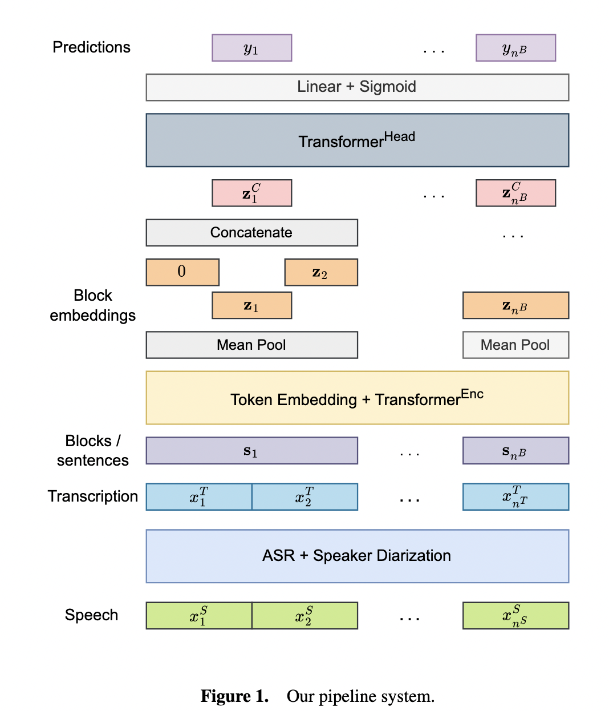
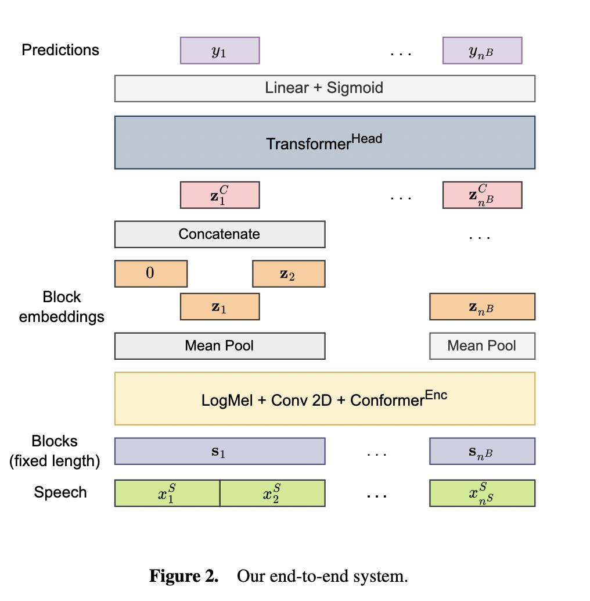
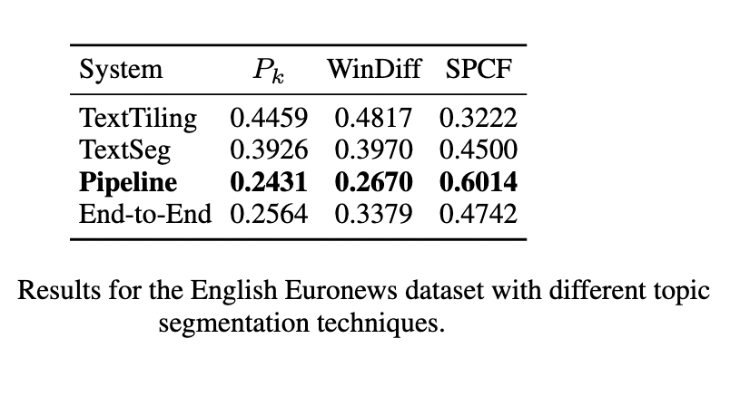

# Advancing Topic Segmentation of Broadcasted Speech with Multilingual Semantic Embeddings

[[Paper]](https://ebooks.iospress.nl/doi/10.3233/FAIA240961)

The field of topic segemtation has yet to be explored well with spoken audio using multilingual semantic represenations.

Since extracting semantic embeddings of speech is harder than extracting semantic representation with transcriptions. Therefore it is important to investigate role of semantic embeddings in speech can be efficient enough to implement an end-to-end speech segemntation pipeline.
The task is a novel investigation followed by another interesting problem which is to analyse whether multilinguality can also be introduced.

## Datasets
To explore how multilingual semantic embeddings can be employed for topic segmentation in speech and text. We explore 6 European Languages: `French, German, English, Italian, Spanish and Portuguese` and investigate over a low-resource language for topic segmentation, `Hindi`.

The following table provides detailed information on the dataset.

| **Source Language**  | **Total duration (hrs)** |           |           |**#recordings** |           |           | **avg(#segments)** |           |           |
|----------------------|--------------------------|-----------|-----------|-----------------|-----------|-----------|--------------------|-----------|-----------|
|                      | **train** | **dev**   | **test**  | **train** | **dev**   | **test**  | **train**  | **dev**   | **test**  |
**Euronews**         |                          |           |           |                 |           |           |                    |           |           |
| English              | 226.31                   | 10.05     | 11.16     | 1168            | 65        | 65        | 7.11               | 7.33      | 7.89      |
| French               | 191.14                   | 10.98     | 11.56     | 1204            | 67        | 67        | 6.89               | 7.10      | 7.71      |
| German               | 154.23                   | 8.46      | 9.94      | 980             | 54        | 55        | 7.28               | 7.53      | 7.85      |
| Italian              | 135.18                   | 7.85      | 8.78      | 861             | 48        | 48        | 6.95               | 6.68      | 8.16      |
| Portuguese           | 46.43                    | 2.14      | 2.24      | 286             | 16        | 16        | 7.05               | 6.68      | 6.75      |
| Spanish              | 150.74                   | 10.03     | 9.71      | 465             | 26        | 26        | 10.88              | 15.88     | 11.69     |
| **Total**            | **904.03**               | **49.51** | **53.39** | **4964**        | **276**   | **277**   | **7.69**           | **8.53**  | **8.34**  |
**Tagesschau**       |                          |           |           |                 |           |           |                    |           |           |
| German               | 217.09                   | 16.17     | 12.13     | 837             | 45        | 45        | 10.60              | 10.08     | 10.08     |
**Akashvani**        |                          |           |           |                 |           |           |                    |           |           |
| Hindi                | -                        | -         | 14.96     | -               | -         | 51        | -                  | -         | 11.98     |

The dataset can be found [here](./additional_experiments/data) and the following description can be used to get the audio, the respective transcripts and also the information on the chapters.

**Audio**

To download audio files, make sure to install [yt-dlp](https://pypi.org/project/yt-dlp/)
and [ffmpeg](https://www.ffmpeg.org/), and run the following command:

```shell
python download_audio.py
```

This might take several hours to finish.

Audio files will be located in `wav` subdirectory of each directory.

**Partitions**

List files in each directory correspond to the data partitions:
 - `train.lst` -- traininig data;
 - `val.lst` -- validation (development) data;
 - `test.lst` -- testing (evaluation) data.

Training and validation data are not provided for the `akashvani` subset.

**JSON**

JSON files are located in `json` subdirectory of each directory.

All JSON files contain two fields:
 - `chapters` -- topic segments;
 - `sentences` -- automatic transcriptions divided into sentences and grouped into topic segments.

Transcriptions are not provided for the `akashvani` subset
and for the `euronews_en/json/WY66vzBSWxg.json` and `euronews_de/json/PzcL3Gjvxcg.json` files.

## Architecture
**Pipeline:** The model follows a pipeline architecture where the speech is fed into an ASR and transcriptions are generated. These transcriptions are fed into the topic segmentation model. 

<table>
  <tr>
    <td></td>
    <td></td>
  </tr>
</table>

**End-to-End:** The end-to-end approach eliminates the dependency of an ASR and performs topic segmentation directly on speech.


## Training
For training, we use .yaml configurations in the command line.


**End-to-End:**
```shell
python ./sonar_multilingual_segmentation/src/train.py experiment=sonar_audio_euronews_concat model=attention model.net.num_layers=4 name=en_en_en
```

**Pipeline:**
```shell
python ./sonar_multilingual_segmentation/src/train_text.py experiment=sonar_text_euronews_concat model=attention model.net.num_layers=4 name=en_en_en
```

**Text Tiling:**
```shell
python texttiling.py ../data/euronews_en 
```
## Evaluation
P<sub>k</sub> and Windiff are benchmark Evaluation Metrics for Topic Segmentation ([metric explanation](https://pypi.org/project/segeval/)).

To evaluate the P<sub>k</sub> and Windiff score use the following command in python.

```python
from src.utils.evalutils import pk, win_diff
```


Segmentation purity and coverage F-score

Two similar scripts are provided to calculate the segmentation purity and coverage F-score and can be found [here](./additional_experiments/evaluation)
([metrics explanation](https://pyannote.github.io/pyannote-metrics/reference.html#segmentation)):
 - `segmentation_f_measure_e2e.py` -- intended for the output of an audio-based end-to-end system, which provides one label for each window of a fixed size (currently hardcoded to 10 seconds);
 - `segmentation_f_measure_pipeline.py` -- intended for the output of a text-based pipeline system, which provides one label for each sentence.

Usage is the same for both scripts:

```shell
python segmentation_f_measure_e2e.py /path/to/reference /path/to/hypothesis
```
Here `/path/to/reference` is the path to the reference data, for example `../data/euronews_en/`,
and `/path/to/hypothesis` is the path to the system output.

## Result
Results of Other models, Texttiling,Pipeline and End-to-end are as follows:
 

## Inference

You need to install [SONAR](https://github.com/facebookresearch/SONAR), `python version==3.10` using `pip install sonar-space`, [checkpoints](https://zenodo.org/records/13338560).

To perform inference for pipeline approach, use `inference_text.py`. 
```shell
cd ./sonar_multilingual/
conda activate <your sonar env>
python inference_text.py
```
To perform inference for end-to-end approach, use `inference_audio_3win.py`.

```shell
cd ./sonar_multilingual/
conda activate <your sonar env>
python inference_audio_3win.py
```

